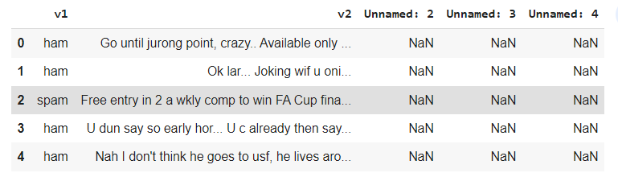
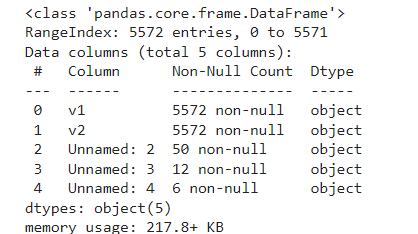
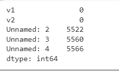
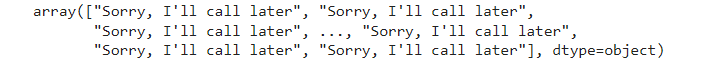
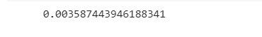

# Implementation-of-SVM-For-Spam-Mail-Detection

## AIM:
To write a program to implement the SVM For Spam Mail Detection.

## Equipments Required:
1. Hardware – PCs
2. Anaconda – Python 3.7 Installation / Moodle-Code Runner

## Algorithm
1. .Import the required libraries.
2. Upload the csv file and read the dataset.
3. Check for any null values using the isnull() function.
4.Predict the required output.
5.End the program. 

## Program:
```
/*
Program to implement the SVM For Spam Mail Detection..
Developed by: Prethiveerajan P
RegisterNumber:  212221230079
*/
import pandas as pd
df  = pd.read_csv("/content/spam.csv",encoding = 'latin-1')
df.info()
df.isnull().sum()
x = df["v1"].values
y  = df["v2"].values
from sklearn.model_selection import train_test_split
x_train,x_test,y_train,y_test = train_test_split(x,y,test_size = 0.2,random_state = 0)
from sklearn.feature_extraction.text import CountVectorizer #countbvectorizer  is a method to convert text to numerical data
cv = CountVectorizer()
x_train = cv.fit_transform(x_train)
x_test = cv.transform(x_test)
from sklearn.svm import SVC
svc = SVC()
svc.fit(x_train,y_train)
y_pred = svc.predict(x_test)
y_pred
from sklearn import metrics
accuracy  = metrics.accuracy_score(y_test,y_pred)
accuracy
```


## Output:
## reading dataset:


## info :


## null value:


## Y_pred:


## accuracy:



## Result:
Thus the program to implement the SVM For Spam Mail Detection is written and verified using python programming.
